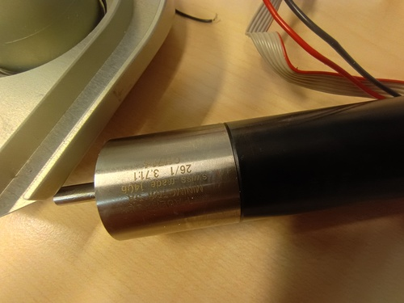
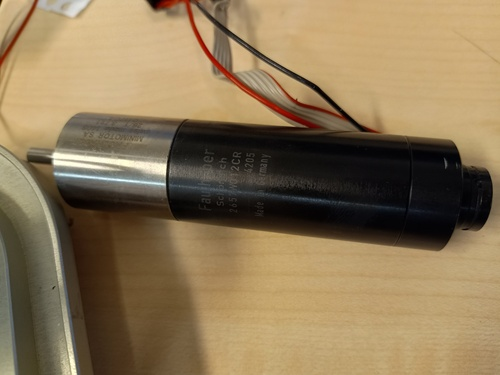
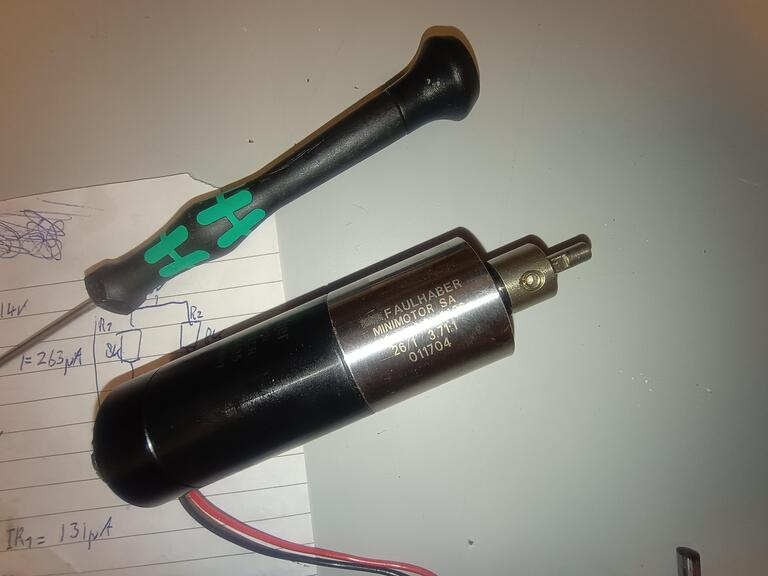
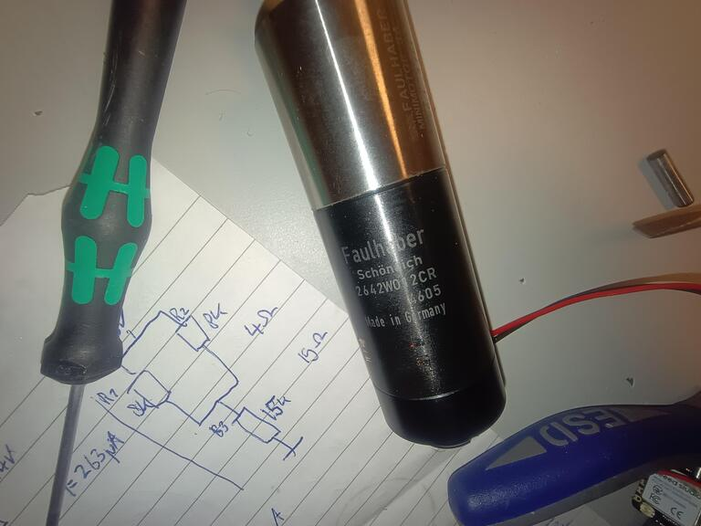
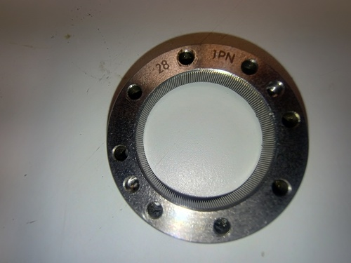

# Robot katana refurbish project

## robot arm specs

- 6 axis with 6 pid controlled dc motors
- 64 step/revolution encoder on each motor
- esp32s3 for each axis

## The robot

## specifications:

|Axis   |Specs   |Gear  |Motor  |
|---|---|---|---|
|Hip |  |    |   |
|Shoulder |motor: [faulhaber 2657cr](https://www.faulhaber.com/en/products/series/2657cr/) / gear: [3.7x](https://www.faulhaber.com/en/products/series/261r/#1566) * strainwave 100x; Encoder: 64CPR |  | |
|Ellbow   |motor: [faulhaber 2642cr](https://www.faulhaber.com/en/products/series/2642cr/) / gear: [3.7x](https://www.faulhaber.com/en/products/series/261r/#1566) * strainwave 100x; [Encoder 360CPR](https://docs.broadcom.com/docs/AS22-Kit-Encoder-DS102) | |    |
|Wrist bend   |   |   |    | 
|Wrist rotate |   |   |    | 
|Fingers      |   |   |    | 

