# Robot katana refurbish project

## Global specs

- 6 axis with 6 pid controlled dc motors
- 64 step/revolution encoder on each motor
- esp32s3 for each axis
- custom motor [controller](https://github.com/bcbergmanuu/dc-motor-driver) PCB

## The robot

[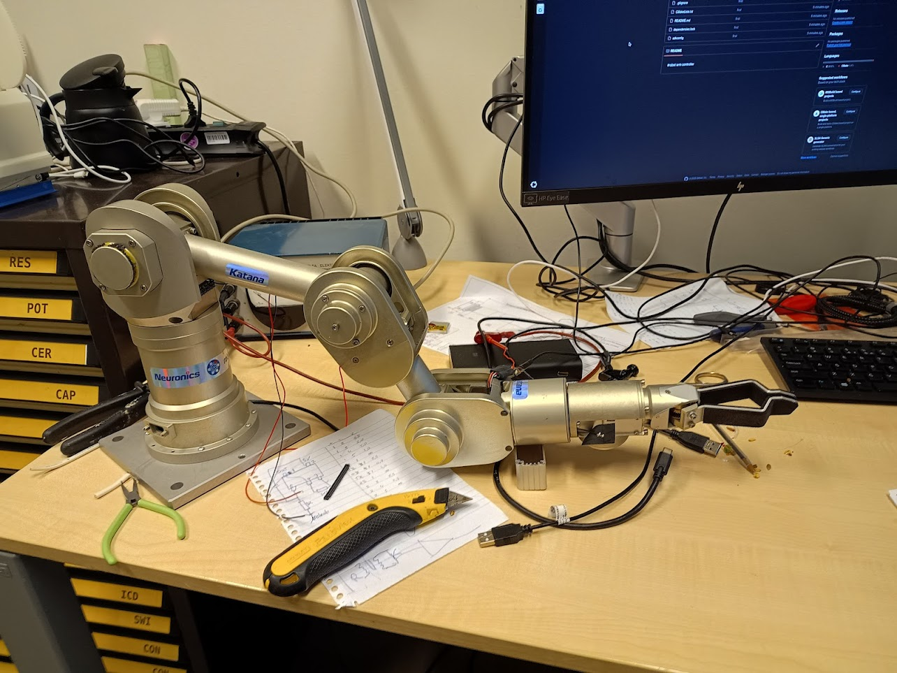](assets/robot.jpg)

## Axis specifications:

|Axis   |Motor |  | Gear |  | Encoder
|---|---|---|---|---|---|
|Hip | [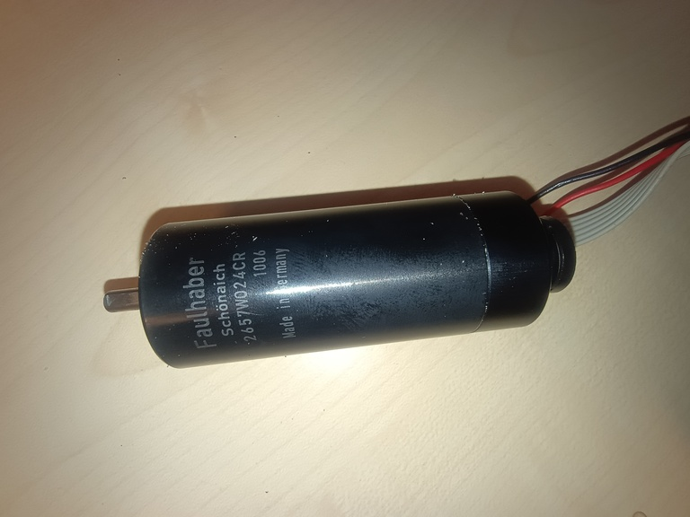](assets/motor-hip.jpg) | [faulhaber 2657cr 24v](https://www.faulhaber.com/en/products/series/2657cr/) | | strainwave 100x | IE2-128CPR |
|Shoulder | [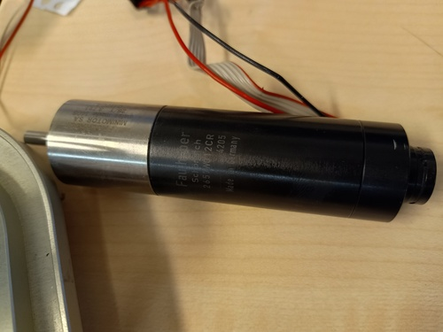](assets/shoulder-motor.jpg) | [faulhaber 2657cr 12v](https://www.faulhaber.com/en/products/series/2657cr/) |[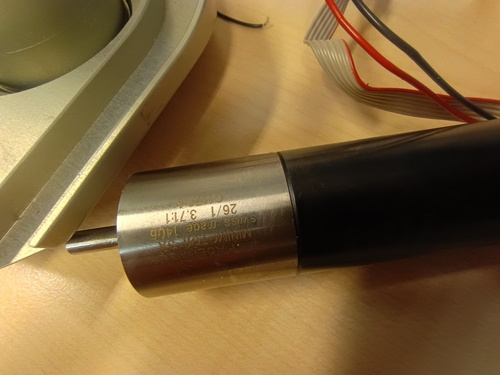](assets/shoulder-gear.jpg) | [3.7x](https://www.faulhaber.com/en/products/series/261r/#1566) * strainwave 100x; | IE2-64CPR |
|Ellbow  |[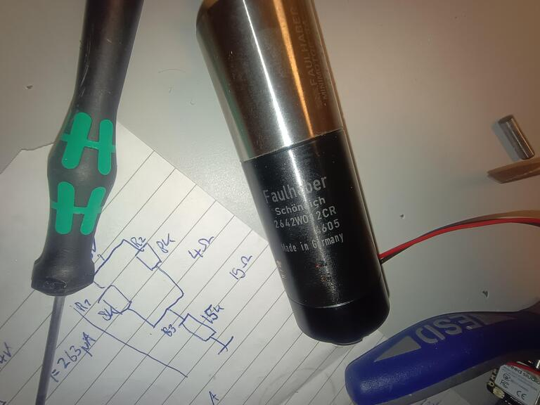](assets/motor-ellbow.jpg) | [faulhaber 2642cr 12v](https://www.faulhaber.com/en/products/series/2642cr/) | [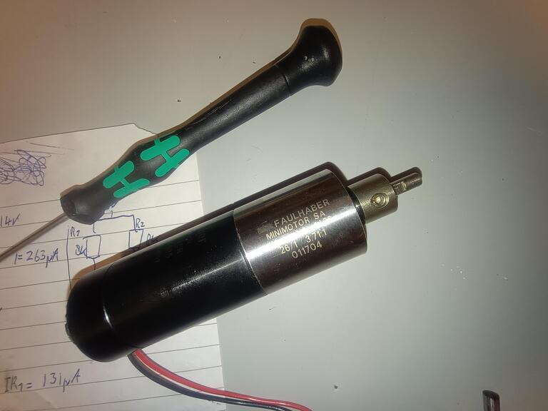](assets/gear-ellbow2.jpg) | [3.7x](https://www.faulhaber.com/en/products/series/261r/#1566) * strainwave 100x;  | [360CPR](https://docs.broadcom.com/docs/AS22-Kit-Encoder-DS102) |
|Wrist bend |   |   |   |   |
|wrist rotate     |   |[faulhaber 2224sr 12v](https://www.faulhaber.com/en/products/series/2224sr/#37029)   | strainwave 100x  | 128CPR   | 
|Fingers   | [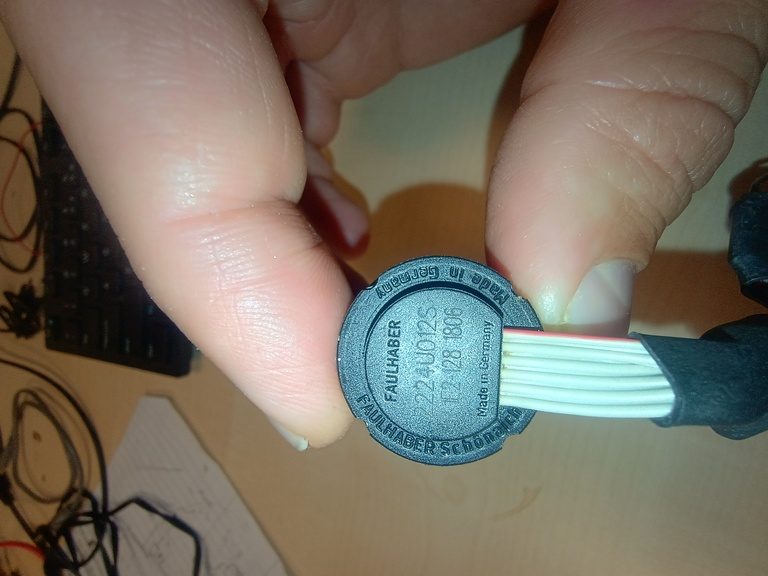](assets/wrist-rotate.jpg) | [faulhaber 2224sr 12v](https://www.faulhaber.com/en/products/series/2224sr/#37029) |   |strainwave 100x  | IE2-128cpr |

## Intereseting parts
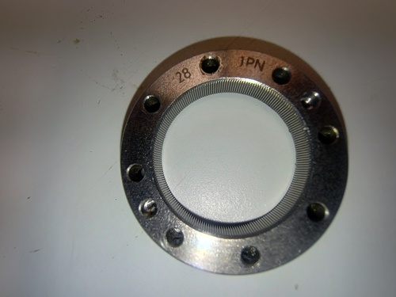

## PID calculations
script:
``
load("motor_data_c.mat")

data_obj = iddata(motor_c(:,2), motor_c(:,1), 0.001);

h = tfest(data_obj, 2, 1);

compare(h, data_obj)

%j = h * 1000;

s = tf('s');

hd = c2d(h, 0.001);
``

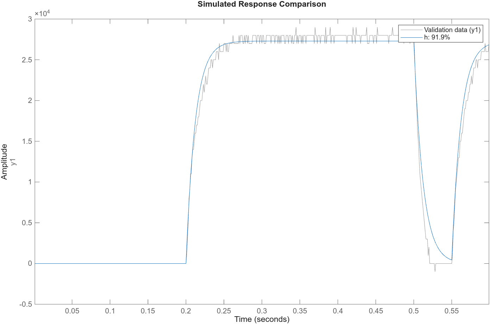
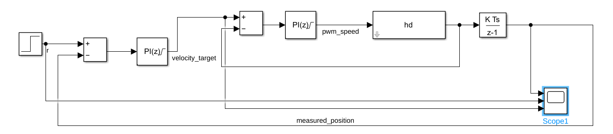
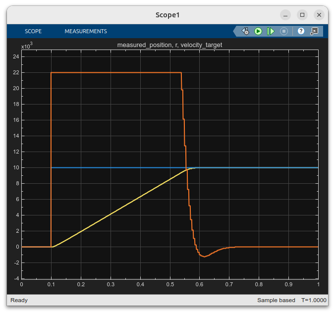