# Robot katana refurbish project

## Global specs

- 6 axis with 6 pid controlled dc motors
- 64 step/revolution encoder on each motor
- esp32s3 for each axis
- custom motor [controller](https://github.com/bcbergmanuu/dc-motor-driver) PCB

## The robot

[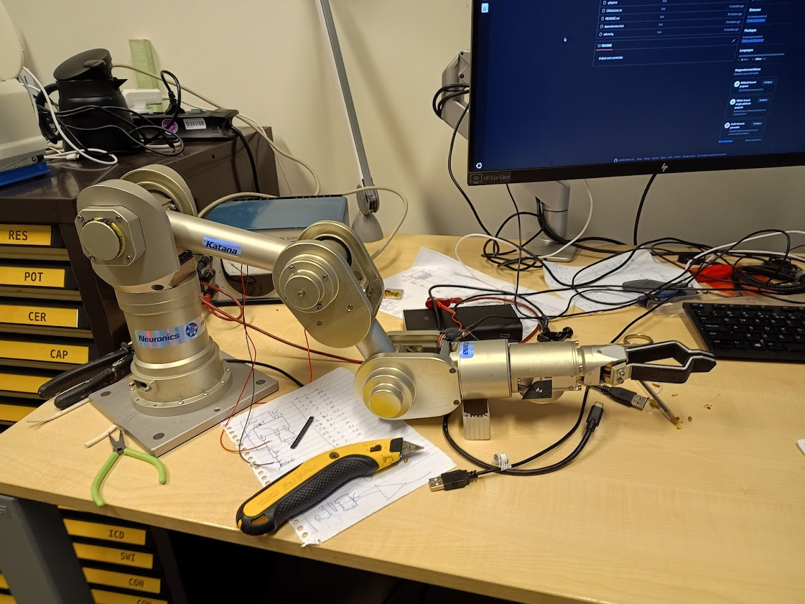](assets/robot.jpg)

## Axis specifications:

|Axis   |Motor |  | Gear |  | Encoder
|---|---|---|---|---|---|
|Hip | [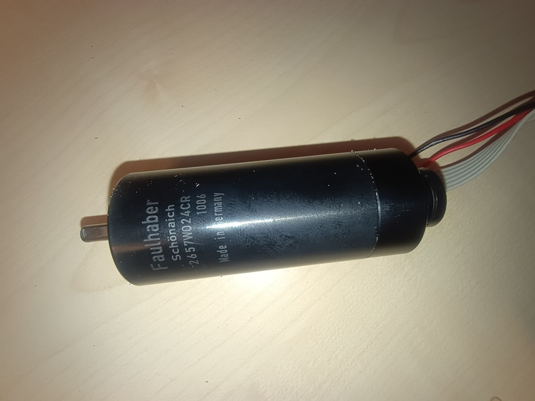](assets/motor-hip.jpg) | [faulhaber 2657cr 24v](https://www.faulhaber.com/en/products/series/2657cr/) | | strainwave 100x | IE2-128CPR |
|Shoulder | [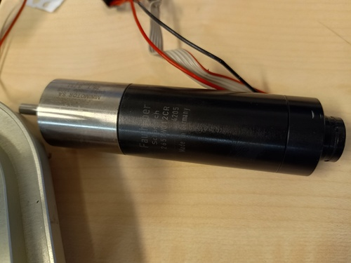](assets/shoulder-motor.jpg) | [faulhaber 2657cr 12v](https://www.faulhaber.com/en/products/series/2657cr/) |[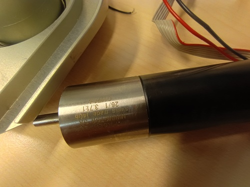](assets/shoulder-gear.jpg) | [3.7x](https://www.faulhaber.com/en/products/series/261r/#1566) * strainwave 100x; | IE2-64CPR |
|Ellbow  |[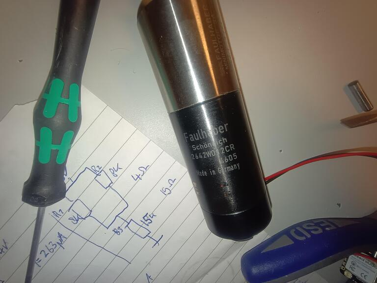](assets/motor-ellbow.jpg) | [faulhaber 2642cr 12v](https://www.faulhaber.com/en/products/series/2642cr/) | [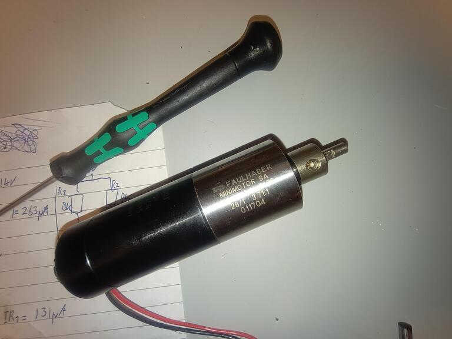](assets/gear-ellbow2.jpg) | [3.7x](https://www.faulhaber.com/en/products/series/261r/#1566) * strainwave 100x;  | [360CPR](https://docs.broadcom.com/docs/AS22-Kit-Encoder-DS102) |
|Wrist bend |   |   |   |   |
|wrist rotate     |   |[faulhaber 2224sr 12v](https://www.faulhaber.com/en/products/series/2224sr/#37029)   | strainwave 100x  | 128CPR   | 
|Fingers   | [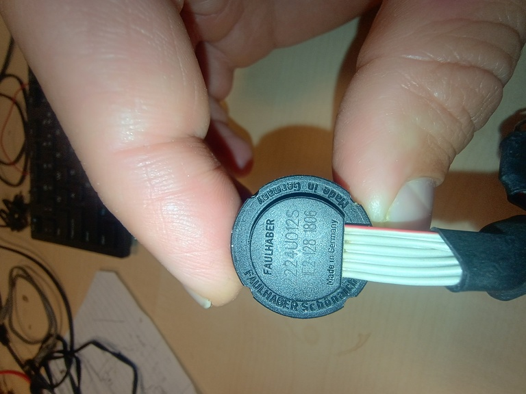](assets/wrist-rotate.jpg) | [faulhaber 2224sr 12v](https://www.faulhaber.com/en/products/series/2224sr/#37029) |   |strainwave 100x  | IE2-128cpr |


## Intereseting parts
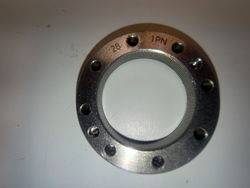

## PID calculations
script:
```
load("motor_data_c.mat")

data_obj = iddata(motor_c(:,2), motor_c(:,1), 0.001);

h = tfest(data_obj, 2, 1);

compare(h, data_obj)

%j = h * 1000;

s = tf('s');

hd = c2d(h, 0.001);
```

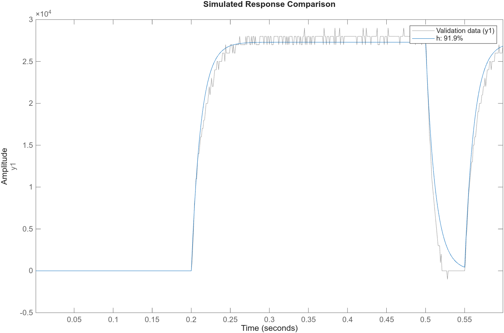
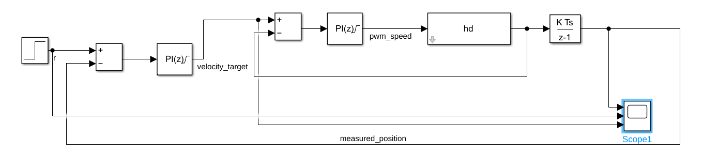
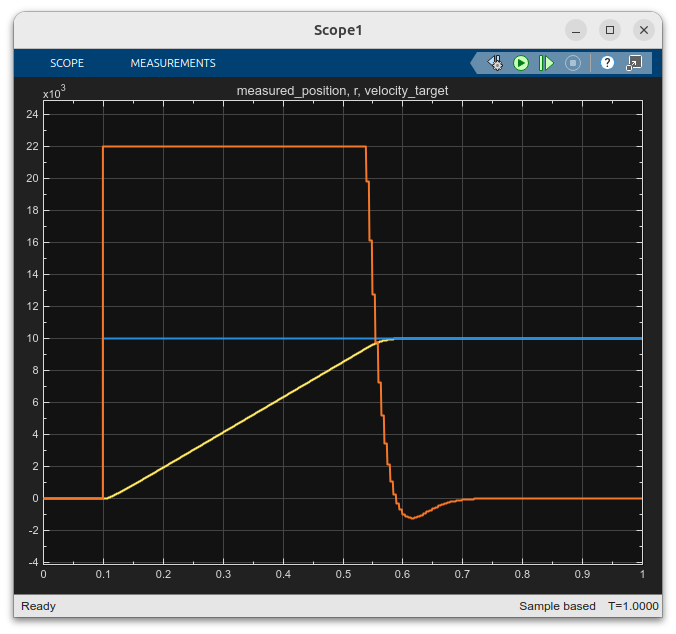

## Software

The refurbish rewrite (this repo, `feature/sim-teleop`) replaces the original MATLAB/Simulink PID
work above with: a portable C axis core (`components/axis_core/`) that runs unmodified on both the
ESP32-S3 boards and a host build; a MuJoCo simulator that drives six real `axis_core` instances so
the whole arm can be jogged and identified without hardware; and a Python master
(`uv run robotarm ...`) that talks to either the simulator or the real robot over the same CAN
protocol. See `docs/architecture.md` for the full design, `docs/protocol.md` for the CAN protocol,
`docs/simulator.md` for the simulator and bench motor identification, `docs/teleop.md` for the
PlayStation-controller teleop, and **`docs/bringup.md` for what to do once the robot is back** —
read that one first.

### Firmware pinout (`main/board.h`)

One ESP32-S3 (Seeed XIAO) plus a [bcbergmanuu/dc-motor-driver](https://github.com/bcbergmanuu/dc-motor-driver)
TB9051FTG H-bridge PCB per axis; each board is flashed with its own CAN node id (1-6, one per row
in `config/arm.yaml`'s `axes:` list) via `CONFIG_AXIS_NODE_ID`: `scripts/build_node.sh N build` /
`scripts/build_node.sh N flash -p PORT` (see `docs/bringup.md`).

| Signal | GPIO | Note |
|---|---|---|
| `MOT_PWM2` (H-bridge input A) | 7 | MCPWM, 25 kHz |
| `MOT_PWM1` (H-bridge input B) | 8 | MCPWM, 25 kHz; both low = brake (duty 0) |
| Encoder A (`ENCODER_B` net) | 1 | PCNT, x4 decode |
| Encoder B (`ENCODER_A` net) | 9 | PCNT, x4 decode |
| `MOT_OCM` (current sense) | 4 | ADC1 channel 3, `ADC_ATTEN_DB_12` (~2.5 V range); ~528 mV/A (assumed, see `docs/bringup.md`) |
| TB9051 `OCC` (over-current comparator) | 2 | left unconfigured — open hardware question, see `docs/bringup.md` |
| CAN TX (TWAI) | 43 | 1 Mbit/s |
| CAN RX (TWAI) | 44 | 1 Mbit/s |

The console (`idf.py monitor`) is USB-Serial-JTAG, so it shares the same USB-C port used to flash
the board — no separate UART adapter needed.

### Quick start

Prerequisites: [`uv`](https://docs.astral.sh/uv/) (Python 3.12 + the virtual env), `cmake` (host
build, Apple Clang or GCC — no `ninja` needed), and Docker (or Colima) running, for the firmware
build (`espressif/idf:v6.1`, pulled automatically by `scripts/idf.sh`).

```
uv sync                                       # install the Python virtualenv from pyproject.toml
make test                                     # host C tests (ctest) + Python tests (pytest) -- run this first
make sim                                      # MuJoCo simulator with viewer, on tcp://127.0.0.1:29536
scripts/sim.sh --no-viewer                    # ...or headless (any platform, no window server needed)
make teleop                                   # PlayStation-controller master, against the simulator above
uv run robotarm gamepad-test                  # check a paired controller before trusting it to teleop
uv run robotarm identify --bus sim --node 2 --duty 0.5   # open-loop step, sim or robot -> identify_node2.csv
uv run robotarm stepfit identify_node2.csv --motor faulhaber_2224sr_12v --supply 12 --cpr 256
                                              # fit the bench motor model -> stepfit_identify_node2.yaml/.png
scripts/idf.sh build                          # build the ESP32-S3 firmware in Docker (node 1, no flashing)
scripts/build_node.sh 3 build                 # ...per board: node id 3 -> build/node3 (flash: see docs/bringup.md)
uv run robotarm axis home --node 3 --bus <URL>   # bring-up: home/enable/disable/clear one axis
```

`make sim` and `make teleop` are the two halves of one demo: run `make sim` in one terminal and
`make teleop` in another, then Triangle to home, Cross to enable, hold L1 and jog with the sticks
(full controller layout in `docs/teleop.md`).