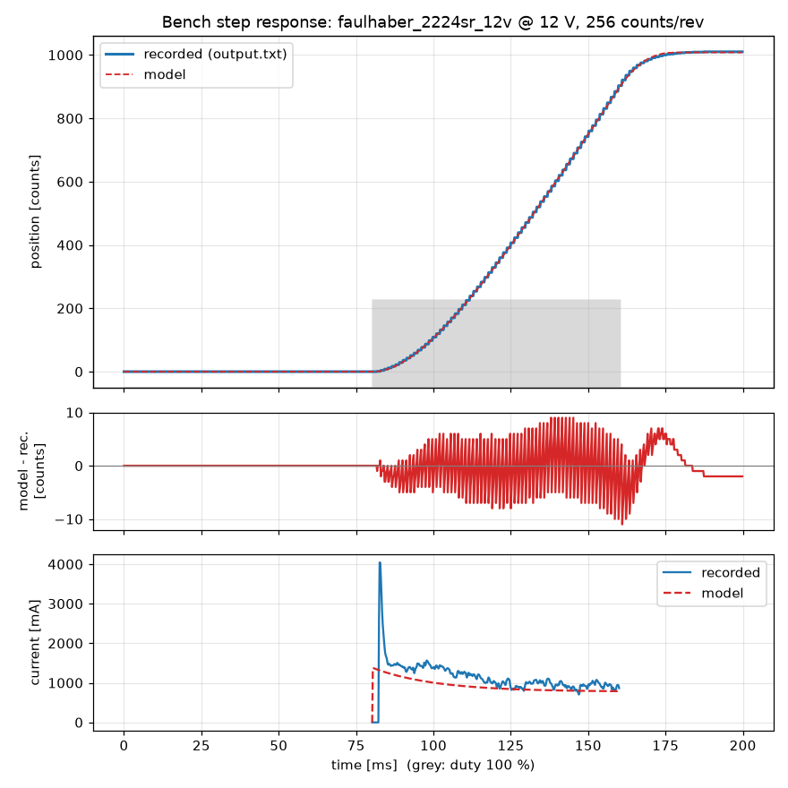

# Simulator

## Running it

`make sim` starts the real-time simulator server with its MuJoCo viewer, listening for a master
on `tcp://127.0.0.1:29536`. In a second terminal, run the teleop master or `uv run robotarm
monitor --bus tcp://127.0.0.1:29536` to watch axis state/position/faults.

```
make sim                                                # with viewer (via scripts/sim.sh, see below)
uv run robotarm sim --no-viewer                         # headless, any platform, plain `python`/`uv run` is fine
uv run robotarm sim --no-viewer --host 0.0.0.0 --port 29536
uv run robotarm sim --start zero                        # start every joint at q=0 instead of 5° off its home stop
```

**macOS + viewer needs `mjpython`, and `mjpython` needs help finding libpython.** MuJoCo's
passive viewer (`mujoco.viewer.launch_passive`) opens a Cocoa window, which on macOS must run on
the process's real main thread; `mjpython` (installed alongside the `mujoco` package) re-execs
the interpreter to arrange that. Running `robotarm sim` under plain `python`/`uv run` on macOS
with a viewer fails fast:

```
$ uv run robotarm sim
run with: make sim  (or: uv run mjpython -m robotarm sim)
$ echo $?
2
```

(detected by checking for the `MJPYTHON_BIN` environment variable the `mjpython` launcher sets
on itself before it execve's into the real interpreter). Separately, `mjpython`'s native binary
dlopens the interpreter's `libpython`, and with `uv`'s standalone CPython that library lives
wherever `sysconfig.get_config_var("LIBDIR")` says (e.g.
`~/.local/share/uv/python/cpython-3.12.12-macos-aarch64-none/lib`), not next to the executable —
without `DYLD_LIBRARY_PATH` pointed at it, `mjpython` fails to start at all. `scripts/sim.sh`
(what `make sim` runs) sets that up on macOS and just runs plain `python -m robotarm sim` on
Linux, where none of this applies. Pass `--no-viewer` to skip the viewer and run under plain
`python` instead — this is what CI and `pc/tests/test_tcp_bus.py` do, and also the first thing to
try **if the viewer window itself crashes** on your machine (this hasn't been exercised on every
platform).

`uv run robotarm monitor --bus URL` connects to any bus (see `robotarm.bus.open_bus`: `tcp://host:port`
for a running `robotarm sim`, `sim` for a disposable in-process one, or a real interface —
`slcan:/dev/tty...`, `gs_usb:0`, `socketcan:can0`, `pcan:PCAN_USBBUS1` — for the robot) and prints
one line per axis, once a second, until Ctrl-C.

## Architecture: SimWorld, SimServer, TcpBus

```
        real-time process ("robotarm sim")                     master process
   ┌──────────────────────────────────────────┐         ┌───────────────────────────┐
   │  MuJoCo viewer  <── handle.sync() ~60 Hz  │         │  ArmClient / Teleop /     │
   │        ▲                                  │         │  `robotarm monitor`       │
   │        │ (under world._lock + handle.lock)│         └─────────────┬─────────────┘
   │  ┌─────┴──────┐   deliver()/step(1ms)  ┌───┴────┐   13-byte frames  │
   │  │  SimWorld  │◄───────────────────────│SimServer│◄══════TCP═══════►│  TcpBus
   │  │ (MuJoCo +  │   take_outgoing()      │(accept  │                 │
   │  │ 6×NativeAxis)──────────────────────►│+ per-   │                 │
   │  └────────────┘                        │client   │                 │
   │        ▲ run_realtime() paces all of    │reader   │                 │
   │        │ this against wall-clock time   │threads) │                 │
   └────────┴─────────────────────────────────┴────┴────┘                 │
                                                        (any number of clients,
                                                         e.g. master + monitor,
                                                         all see the same broadcasts)
```

- **`SimWorld`** (`pc/robotarm/sim/world.py`, Task 12) owns the MuJoCo model/data and six
  `NativeAxis` (`libsimaxis`, i.e. real `axis_core` C code) instances, one per joint. `step(n_ms)`
  advances n milliseconds; `deliver(msg)` feeds a CAN frame to every simulated node; frames the
  nodes transmit collect in an internal buffer, drained by `take_outgoing()`. It has its own
  `RLock` so it's safe to call from more than one thread (the real-time loop and, when a viewer
  is attached, the sync callback).
- **`SimServer`** (`pc/robotarm/sim/server.py`, this task) is the TCP front end: it accepts any
  number of client connections, one reader thread per client, and merges every client's inbound
  frames into a single queue (`take_inbound()`) that only ever reaches the world — clients never
  see each other's raw frames, only what the world itself broadcasts (`broadcast(msgs)` fans a
  batch of frames out to every connected client). This is what lets a master and a `robotarm
  monitor` connect to the same `robotarm sim` process at once.
- **`run_realtime(world, server, viewer, stop_event)`** is the loop that ties the two together:
  each iteration it works out how many 1 ms steps wall-clock time now calls for (`robotarm.sim.
  pacing.steps_to_catch_up`, capped at `DEFAULT_CATCH_UP_CAP` = 50 per iteration, so a stall never
  blocks it from checking `stop_event` or resyncing the viewer for long), delivers
  `server.take_inbound()` before each individual step, then broadcasts `world.take_outgoing()`.
  When a viewer is attached, every `world.step(1)` in that batch runs inside `with handle.lock():`
  — MuJoCo's passive viewer renders (and handles perturbations) from the same `mjData` on its own
  thread, and `handle.lock()` is the mutex it actually respects, so stepping physics outside it
  would race the viewer's reads/writes. `handle.sync()` (called separately, at ~60 Hz) locks
  internally too; `run_realtime` additionally takes `world._lock` around it so a concurrent
  `world.step` from another caller can't be mutating qpos/qvel mid-sync either.
  `robotarm.sim.pacing` also backs the simpler background thread that
  `robotarm.bus.open_bus("sim")` starts (no server, no viewer, so no locking beyond `SimWorld`'s
  own) — the two share the catch-up arithmetic, not the loop body.
- **`TcpBus`** (`pc/robotarm/transport/tcp_bus.py`) is the client side: a `can.BusABC` that
  connects a plain TCP socket to a `SimServer` and speaks the same 13-byte frame format
  (`struct.pack("<IB8s", arbitration_id, dlc, data.ljust(8, b"\0"))`) in both directions. A
  background reader thread turns the stream back into framed `can.Message`s so `recv()` can
  block with a timeout like any other python-can bus. Failing to connect raises
  `SimNotRunningError` (`"no simulator at host:port -- start it with `make sim`"`), which the
  `sim`/`monitor` CLI commands turn into `error: ...` on stderr and exit code 2.

## Time handling: lockstep vs real-time

Two different drivers advance the same `SimWorld`, for two different purposes:

- **Lockstep** (`pc/robotarm/sim/harness.py:run_lockstep`, Task 12): steps the world exactly one
  millisecond at a time, calling an `on_ms` callback after each step. No wall clock involved —
  a 3-second test runs however fast Python and MuJoCo allow. Used by `pc/tests/test_world.py`,
  `robotarm tune`/`stepfit` and anywhere a test needs deterministic, repeatable timing.
- **Real-time** (`pc/robotarm/sim/server.py:run_realtime`, and the equivalent background thread
  `robotarm.bus.open_bus("sim")` starts for an in-process bus): paces the world against
  `time.monotonic()` so 1 simulated second takes ~1 wall-clock second, which is what a human
  driving a gamepad or a real CAN master expects. It steps in bursts of up to 50 ms to catch up
  after a stall (e.g. a slow viewer frame) without ever running unboundedly far ahead, and logs
  a warning (at most once a second) if it can't keep up.

The simulated encoders are incremental like the real boards: each reads 0 at the first
simulated tick wherever the joint physically is, so positions only become absolute after homing
— true whichever driver is stepping the world.

## Motor model validation

The simulator is only as trustworthy as its motor model, so the model is checked against the
one open-loop recording we have from real hardware: `output.txt` in the repo root
(1000 samples at 200 µs, 100 % duty from sample 401 to 800, then duty 0).

### Model

`host/sim/bench.c` (built into `build/host/libsimaxis`, driven from Python through
`robotarm.sim.native`) simulates one DC motor driving an inertia, everything referred to the
motor shaft:

- Electrical (`host/sim/motor_model.c`): `L di/dt = duty·V_supply − R·i − k_t·ω`, solved
  exactly per substep; torque `T = k_t·i`. Duty 0 shorts the winding (the TB9051FTG brakes),
  so the back-EMF drives a braking current.
- Mechanical: `J dω/dt = T − b·ω − T_c·sign(ω)`, integrated with 10 substeps per sample.
- Stiction: while `|ω| < 1e-3 rad/s` and `|T| ≤ T_c` the rotor stays at rest. Friction may bring
  the rotor to rest but never reverses it (zero-crossing clamp).
- Encoder: `counts = floor(angle / 2π · counts_per_rev)`.

The motor's `R`, `L`, `k_t` come from `config/arm.yaml`; `J`, `b` and `T_c` are fitted by
`scipy.optimize.least_squares` over `(log J, log b, log T_c)` on the position trace.

Acceleration and deceleration share the same electrical damping `k_t²/R` (driven and
shorted winding alike), so the faster stop after switch-off comes from the Coulomb term:
the rotor decays towards `−T_c/(b + k_t²/R)` instead of towards zero and hits standstill early.
The model reproduces the coast (107 counts recorded) to within a few counts.

### Result

```
uv run robotarm stepfit output.txt --motor faulhaber_2224sr_12v --supply 12 --cpr 256 \
    --plot docs/img/stepfit.png --out config/bench_identified.yaml
```

| parameter | value (motor shaft) |
|---|---|
| `j_total` | 6.28e-7 kg m² |
| `b_viscous` | 7.48e-6 Nm s/rad |
| `tau_coulomb` | 8.35e-3 Nm |
| position RMS error | 3.1 counts (0.31 % of the 1010-count stroke) |
| end-position error | 2 counts (0.20 %) |



The remaining ±10-count sawtooth in the error trace is the recording itself: the logged
position only updates every 3–4 samples. `pc/tests/test_steptest.py` re-runs the committed
`config/bench_identified.yaml` against `output.txt` and requires end position and RMS within
5 % and the coast-down within 30 counts.

### Which motor was on the bench (assumption)

The recording does not say which axis/motor/encoder/supply was used. The position trace alone
cannot tell: every combination of motor (`faulhaber_2657cr_24v/12v`, `2642cr_12v`,
`2224sr_12v`), supply (12 V, 24 V) and encoder (64, 128, 360 lines = 256, 512, 1440 counts)
fits it to ~0.31 % RMS, because `J`, `b`, `T_c` absorb the scale. The recorded **current**
does discriminate:

| assumption | mean model current (driven, after 4 ms) | recorded |
|---|---|---|
| `faulhaber_2657cr_12v` @ 12 V, 256 (the CLI default) | 4.7 A (ADC clipped) — needs `T_c` = 80 mNm | 1.12 A |
| `faulhaber_2224sr_12v` @ 12 V, 256 | 0.91 A | 1.12 A |
| `faulhaber_2224sr_12v` @ 12 V, 512 | 1.14 A | 1.12 A |
| any motor @ 24 V | ≥ 2.3 A | 1.12 A |

Only the small 2224SR 12 V motor at a 12 V supply gives a plausible current (its stall current
is 12 V / 8.7 Ω = 1.4 A; the recorded current extrapolates to ~1.7 A at standstill and ~0 A at
~32 000 counts/s, which matches its no-load speed of 839 rad/s at 256 counts/rev). The committed
identification therefore assumes **`faulhaber_2224sr_12v` at 12 V with a 64-line encoder
(256 counts/rev)**. The 256 vs 512 counts/rev choice is not decisive given the uncalibrated
current sense (`mv_per_a` is itself assumed).

Not modelled: the ~4 A spike in the recorded current in the first 2 ms after switch-on (above
the 2224SR's stall current, so it is likely a sensing/ADC artefact or a lower real `R`), and
the ~2 ms lag of the current reading.

### Redoing this on the robot

`robotarm identify --bus <URL> --node <N> [--duty 1.0] [--out output.txt]` runs the same
open-loop step over CAN instead of the firmware's old hard-coded bench test: enable, duty 0
(80 ms), `--duty` (80 ms), duty 0 (40 ms), disable, recording every STATUS+TELEMETRY pair of
that node into a CSV with exactly `output.txt`'s columns
(`time_us,position,velocity,pwm_ticks,current`). It works on the simulator (`--bus sim` or
`--bus tcp://127.0.0.1:29536` against `robotarm sim`) today and on the real robot later,
unchanged -- the encoders are incremental and DUTY mode is open-loop, so no homing is needed.
It refuses (exit 2) if the axis isn't DISABLED/READY (not FAULT/HOMING) or if `--duty` exceeds
the axis's `max_duty`.

```
uv run robotarm identify --bus sim --node 2 --duty 0.5 --out output.txt
uv run robotarm stepfit output.txt --motor <name> --supply <V> --cpr <4 × lines> \
    --plot docs/img/stepfit.png --out config/bench_identified.yaml
```

Once the arm is back, run this on a known axis with a known motor, encoder and supply, then
refit `J`, `b`, `T_c` per axis and replace the `(assumed)` friction values in `config/arm.yaml`
with the results referred to the joint (`× gear_ratio` for torques, `× gear_ratio²` for `J`
and `b`).

## Gain tuning in simulation

`uv run robotarm tune --axis NAME [--velocity]` homes the simulated arm (lockstep, deterministic)
and prints overshoot, settle time and steady error for a 20° position step (or a velocity step)
on one axis; the procedure and the tuned values are in `pc/robotarm/sim/tune.py` and
`config/arm.yaml`. The reported homing offset (0.1–0.4° per axis) is expected: the axis registers
its home while pressed into MuJoCo's slightly compliant joint limit (default `solref`), so its
zero sits off by that penetration depth — deterministic, and well inside the 1° homing tolerance.

Measured velocity-loop thresholds (loop gain = `vel_kp` × no-load counts/s per unit duty, `vel_ki` = 0,
first velocity-step overshoot > 10 %, worse of the homed and the all-zero pose) and the chosen gains
(50 % of the threshold, `vel_ki = vel_kp / 30 ms`, `pos_kp` = 50 for all axes):

| axis | loop gain at > 10 % | `vel_kp` | `vel_ki` |
|---|---|---|---|
| hip | ~8 (all-zero pose; ~28 when homed) | 7.0e-5 | 2.3e-3 |
| shoulder | ~9 | 8.8e-5 | 2.9e-3 |
| elbow | ~9 | 1.4e-5 | 4.7e-4 |
| wrist_bend (gear 200) | ~15 | 5.5e-5 | 1.8e-3 |
| wrist_rotate | ~11 | 4.0e-5 | 1.3e-3 |
| gripper | ~17 | 6.2e-5 | 2.1e-3 |

The simulated encoders are incremental like the real boards: each reads 0 at the first
simulated tick wherever the joint is, so positions only become absolute after homing.
